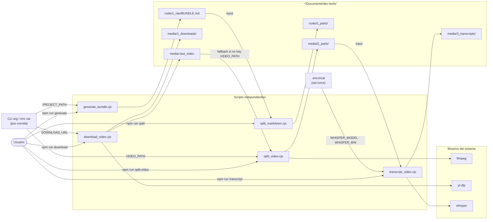
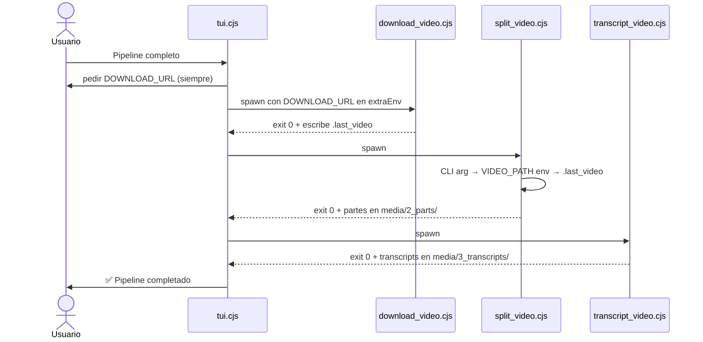

# Diagramas de Componentes

Propósito: mapa estable del sistema. Actualizar solo si cambia topología (agregar/quitar scripts o cambiar flujo de datos).

---

## Sistema actual (sin TUI)



---

## Sistema objetivo (con TUI — FASE 1-3)

```mermaid
flowchart TB
    User([Usuario])

    subgraph tui["TUI — tui.cjs"]
        MAIN[Menú principal]
        SUB[Submenús]
        ASK[askAlways → extraEnv]
    end

    subgraph lib["lib/"]
        ENV_LIB[env.cjs\nloadEnv]
        RUNNER[runner.cjs\nrun(script, extraEnv) → spawn subprocess]
        MENU[menu.cjs\nmainMenu · submenu · askVar]
        MEDIA_LIB[media.cjs\nMEDIA_EXTENSIONS]
    end

    subgraph scripts["Scripts — sin cambios de uso standalone"]
        GEN[generate_bundle.cjs]
        SPLIT_MD[split_markdown.cjs]
        DL[download_video.cjs]
        SPLIT_VID[split_video.cjs]
        TR[transcript_video.cjs]
    end

    subgraph output["~/Documents/dev-tools/"]
        CODE[code/1_raw · code/2_parts]
        MEDIA[media/1_downloads · 2_parts · 3_transcripts]
    end

    ENVFILE[".env.local\n(set-once: WHISPER_MODEL, WHISPER_BIN, DEV_TOOLS_OUTPUT_BASE)"]

    User --> tui
    MAIN --> MENU
    SUB --> MENU
    tui --> ASK
    ASK -->|extraEnv: PROJECT_PATH/DOWNLOAD_URL| RUNNER

    RUNNER -->|spawn + extraEnv| scripts
    scripts -->|loadEnv| ENV_LIB
    ENV_LIB -->|read| ENVFILE
    scripts --> MEDIA_LIB

    scripts --> CODE
    scripts --> MEDIA
```

---

## Flujo de datos — cascada multimedia


