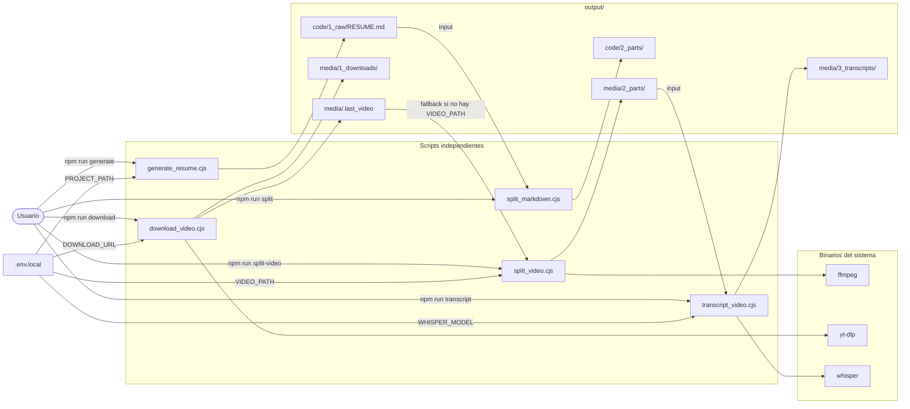
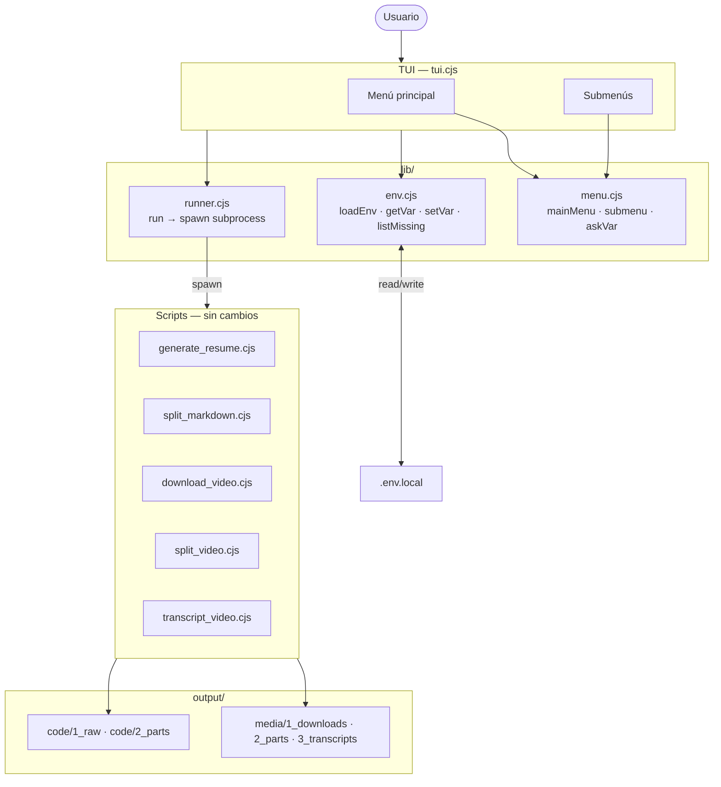
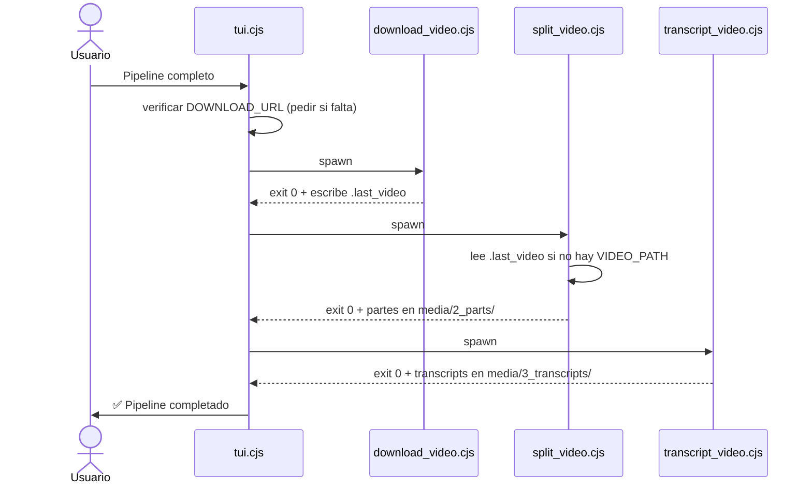

# Diagramas de Componentes

Propósito: mapa estable del sistema. Actualizar solo si cambia topología (agregar/quitar scripts o cambiar flujo de datos).

---

## Sistema actual (sin TUI)

---

## Sistema objetivo (con TUI — FASE 1-2)

---

## Flujo de datos — cascada multimedia

